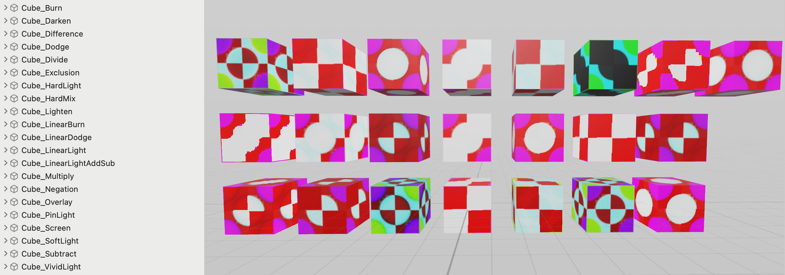

# RealityShaderExtension
RealityShaderExtension is a package that provides a set of shader graph nodes for RealityKit in visionOS, iOS and macOS. 

RealityShaderExtension reproduce 28 Shader Graph nodes from Unity, and 28 Blueprint nodes from Unreal. It will be very useful if you convert shader effects from Unity or Unreal.

RealityShaderExtension also contains 20+ color blend mode, and 8 colorspace conversion node. 

## Examples of nodes from Unreal

## Examples of nodes from Unity

## Examples of Color Blend nodes from Unity and Unreal

