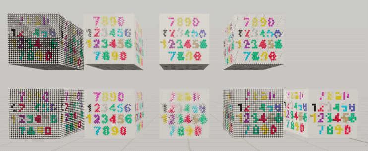

# RealityShaderExtension

[中文版本README](./README_CN.md)

RealityShaderExtension is a package that provides a set of shader graph nodes for RealityKit in visionOS, iOS and macOS. 

RealityShaderExtension reproduce 28 Shader Graph nodes from Unity, and 28 Blueprint nodes from Unreal. It will be very useful if you convert shader effects from Unity or Unreal.

RealityShaderExtension also contains 20+ color blend mode,  8 colorspace conversion nodes, and 9 pixelize art nodes.

## Examples of nodes from Unreal

[Unreal Engine Material Functions Reference](https://dev.epicgames.com/documentation/en-us/unreal-engine/unreal-engine-material-functions-reference)

## Examples of nodes from Unity

[Unity Shader Graph Node Library](https://docs.unity3d.com/Packages/com.unity.shadergraph@12.1/manual/Node-Library.html)

## Examples of Color Blend nodes from Unity and Unreal

[Unity Blend Node](https://docs.unity3d.com/Packages/com.unity.shadergraph@12.1/manual/Blend-Node.html)

[Unreal Blend Functions](https://dev.epicgames.com/documentation/en-us/unreal-engine/blend-material-functions-in-unreal-engine)

## Examples of PixelizeArt node

[Unity X-PostProcessing Library-PixelizeArt](https://github.com/QianMo/X-PostProcessing-Library/tree/master/Assets/X-PostProcessing/Effects/PixelizeQuad)

## How to use
I build the node graph in project using **Instancing**, There are 3 ways to use the node in RealityShaderExtension.
### 1. Copy and Paste immediately
Suitable for **non-nested** Node Graphs. if you copy&paste the **nested** one, it will lost the **nested** Node Graphs.

Of course, you can copy&paste the nested Node Graphs again, and re-connect the nested Node Graph lines for input and output.

### 2. Create Instancing, then copy and paste the Instancing nodes
Suitable for both nested and non-nested Node Graphs.

**Instancing** behaves similarly to a singleton, it can save CPU cost and memory cost, because it only load one instance in memory and reuse it. But you need to put the **original source Node Graphs** in your RealityComposerPro project to reference.

> If you modify the original Node Graphs, all of the Instancing will be changed imdirectly.

You have to put the original Node Graphs in your RealityComposerPro project to reference. You need to keep the relative path fixed, if you move the path of original Node Graphs, the Instancing will not work any more.

### 3. Create Instancing, then disable Instancing
Suitable for both nested and non-nested Node Graphs.

You can **disable Instancing** to modify the original Node Graphs. You can also disable Instancing in all the nested Node Graphs. 
> If you modify the original Node Graphs, it will not change the disabled Instancing. because they are different nodes.

You **don't** need to put the original Node Graphs into your RealityComposerPro project to reference, because all Instancing are disabled, they are actually different full copies of the original Node Graph.

