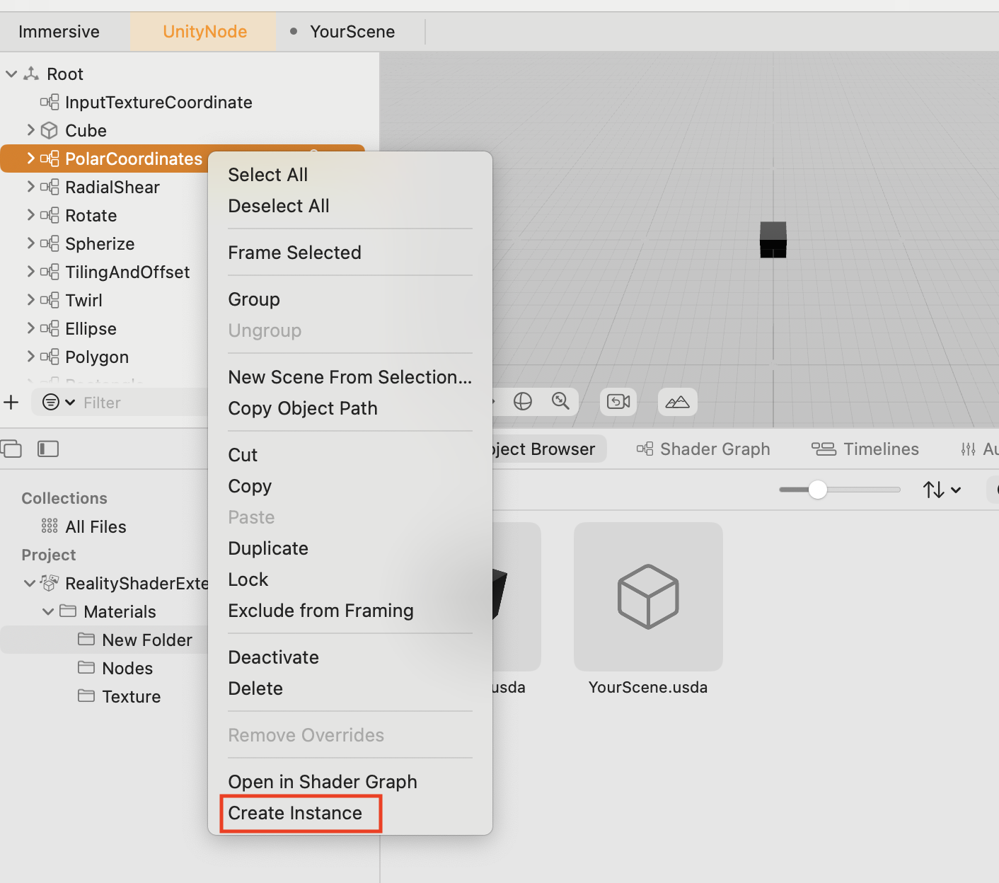
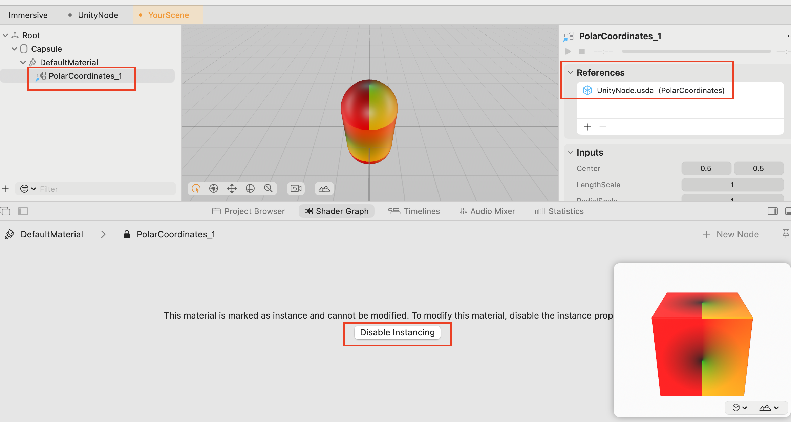
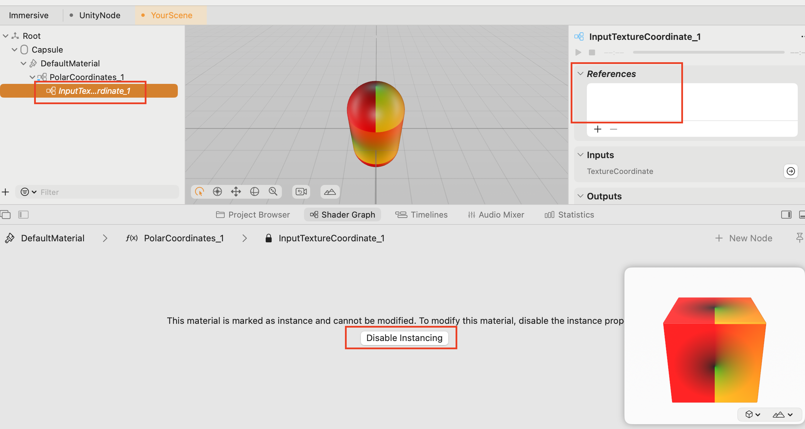

# RealityShaderExtension

[English README](./README.md)

RealityShaderExtension 是一个为 visionOS、iOS 和 macOS 提供一组 Shader Graph 扩展节点的工具包。

RealityShaderExtension 复刻了来自 Unity 的 28 个 Shader Graph 节点和来自 Unreal 的 28 个 Blueprint 节点。如果您需要将 Unity 或 Unreal 中的 Shader 效果转换到 RealityKit，这将非常有用。

RealityShaderExtension 还包含 20 多种颜色混合模式和 8 种颜色空间转换节点。

## Unreal 节点示例

[Unreal Engine Material Functions Reference](https://dev.epicgames.com/documentation/en-us/unreal-engine/unreal-engine-material-functions-reference)

## Unity 节点示例

[Unity Shader Graph Node Library](https://docs.unity3d.com/Packages/com.unity.shadergraph@12.1/manual/Node-Library.html)

## Unity 和 Unreal 的颜色混合节点示例

[Unity Blend Node](https://docs.unity3d.com/Packages/com.unity.shadergraph@12.1/manual/Blend-Node.html)

[Unreal Blend Functions](https://dev.epicgames.com/documentation/en-us/unreal-engine/blend-material-functions-in-unreal-engine)

## 如何使用
我在创建项目中的 Node Graph 时使用了 **Instancing**，所以一般有 3 种方式来使用它。

### 1. 直接复制粘贴
Suitable for **non-nested** Node Graphs. if you copy&paste the **nested** one, it will lost the **nested** Node Graphs.

Of course, you can copy&paste the nested Node Graphs again, and re-connect the nested Node Graph lines for input and output.

适用于 **非嵌套** 的 Node Graph。如果复制并粘贴的 Node Graph 中包含了 **嵌套** 的 Node Graph，将会丢失 **嵌套** 的内容。

当然，您可以再次复制并粘贴嵌套的 Node Graph，并重新连接嵌套 Node Graph 的输入和输出。

### 2. 创建 Instancing，复制粘贴 Instancing 节点
适用于**嵌套和非嵌套**的节点图。

**Instancing **类似于单例，它可以节省 CPU 和内存成本，因为它只在内存中加载一个实例并重复使用它。但您需要将 **原始源 Node Graph** 放入您的 RealityComposerPro 项目中以进行引用。

> 如果您修改原始 Node Graph，所有 Instancing 的内容将会同步发生变化。

您必须将原始 Node Graph 放入您的 RealityComposerPro 项目中以进行引用。您需要保持相对路径保持固定，如果您移动原始节点图的路径，Instancing 将无法正常工作。

### 3. 创建 Instancing，然后禁用 Instancing
适用于嵌套和非嵌套的节点图。

您可以 **禁用实例化（disable Instancing）** 以更加自由地修改复制出来的 Node Graph。您还可以对嵌套的 Node Graph 禁用实例化。

> 如果您修改原始节点图，禁用的实例化将不会发生变化，因为它们是不同的节点。

您 **不** 需要将原始节点图放入您的 RealityComposerPro 项目中进行引用，因为所有实例化都已禁用，它们实际是完整的复制品 Node Graph。

